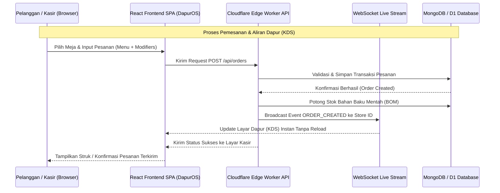
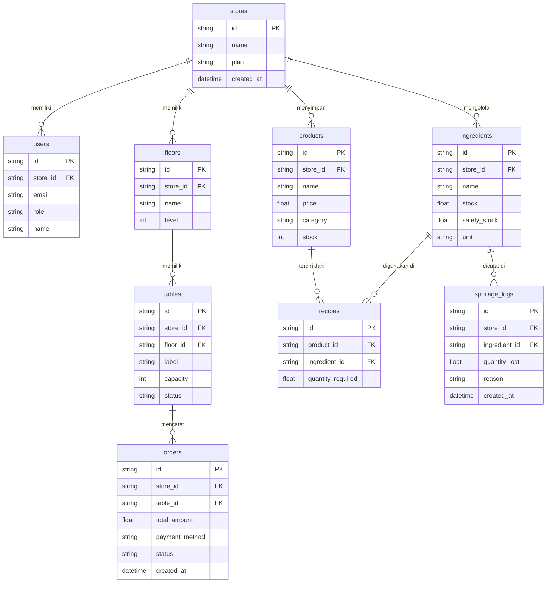

# PRD — Project Requirements Document: DagangOS Unified Multi-SaaS Platform

**Versi:** 3.0 (Full Cloudflare Edge Native & Multi-Ecosystem Architecture)  
**Domain Utama:** `https://dagangos.com`  
**Infrastruktur:** Cloudflare Workers Edge Gateway + Cloudflare Edge Native APIs + GitHub Actions CI/CD  
**Standar Lokalisasi:** 100% Bahasa Indonesia 🇮🇩 (Kebijakan nol bahasa campuran di seluruh antarmuka)

---

## 1. Overview
**DagangOS** adalah platform sistem operasi bisnis terpadu (Unified Multi-SaaS Platform) yang dirancang khusus untuk Usaha Mikro, Kecil, dan Menengah (UMKM) serta enterprise di Indonesia. Masalah utama yang ingin diselesaikan adalah fragmentasi pencatatan operasional, kesulitan melacak persediaan resep mentah (Bill of Materials / BOM), ketidaksinkronan aliran pesanan antara Kasir (Front of House) dan Dapur (Kitchen Display System / KDS), serta hambatan saat berpindah antar aplikasi bisnis yang berbeda.

Tujuan utama DagangOS adalah menyediakan ekosistem berbasis web yang ultra-cepat dan andal melalui dua vertikal aplikasi utama:
- **DapurOS (`https://dagangos.com/dapuros/`):** Sistem operasi F&B lengkap untuk restoran, kafe, cloud kitchen, dan bar dengan denah meja interaktif, pemesanan digital QR Code, KDS dapur real-time, dan manajemen bahan baku BOM.
- **GerainaOS (`https://dagangos.com/geraina/`):** Point of Sale (POS) retail pintar dan manajemen stok inventaris cepat untuk minimarket, toko kelontong, dan butik.

---

## 2. Requirements (Persyaratan Sistem)
Berikut adalah persyaratan tingkat tinggi untuk pengembangan ekosistem DagangOS:
- **Aksesibilitas Multi-Device:** Aplikasi dapat diakses dengan cepat melalui Web Browser (desktop, tablet, maupun smartphone) memanfaatkan Cloudflare Edge Native CDN global.
- **Multi-Tenant & Hak Akses Berbasis Peran (RBAC):** Sistem mendukung multi-outlet dengan pembagian peran terstruktur (Owner, Manager, Cashier, Warehouse) untuk keamanan data.
- **Lokalisasi 100% Bahasa Indonesia 🇮🇩:** Seluruh antarmuka pengguna, label navigasi, dialog modal, struk belanja, dan pesan notifikasi wajib menggunakan Bahasa Indonesia yang konsisten.
- **Real-Time Synchronisation:** Pembaruan status meja, aliran pesanan ke KDS dapur, dan notifikasi stok menggunakan jaringan WebSocket instan (`wss://dagangos.com/api/ws/{store_id}`).
- **Crash-Proof State Safety:** Seluruh komputasi array antarmuka wajib dilengkapi dengan proteksi pembatas (`Array.isArray(...)`) untuk menjamin nol terjadinya layar putih (blank screen) saat penggunaan operasional.

---

## 3. Core Features (Fitur Utama Ecosystem & Sub-Merek)

### 3.1 Portal Utama DagangOS (`https://dagangos.com/`)
1. **Dashboard Portal Terpadu:** Antarmuka landing page modern dengan desain glassmorphism yang mengenalkan seluruh aplikasi ekosistem.
2. **Universal Single Sign-On (SSO):** Sistem login terintegrasi di `https://dagangos.com/login` (`data-testid="login-form"`) yang berlaku untuk semua sub-aplikasi.
3. **Akun Master Demo 1-Click Launch:** Fitur penguji langsung dengan tombol otomatis (`admin@dagangos.com` / `dagangos123`) untuk kemudahan navigasi demo (`data-testid="master-demo-login-btn"`).

### 3.2 Sub-Perusahaan 1: DapurOS (Food & Beverage OS)
1. **Kasir (FOH POS & Layout Meja Interaktif):**
   - **Visual Floor Map:** Denah lantai visual interaktif multi-area (**Lantai 1 Utama**, **Lantai 2 VIP Sofa**, dan **Rooftop Outdoor**).
   - **Crash-Proof Fallback:** Data bawaan (`DEFAULT_FLOORS` & `DEFAULT_TABLES`) menjamin denah meja 100% terisi dan dapat diinteraksi kapan saja.
   - **Indikator Status Meja:** Status visual otomatis: **Kosong (Vacant)**, **Tamu Duduk (Seated)**, **Dining / Aktif**, dan **Minta Tagihan (Billing)**.
   - **Fitur Split Bill Multi-Tamu:** Penanganan bagi tagihan secara merata (Equal Split), berdasarkan item pesanan (By-Item Split), maupun kombinasi metode pembayaran kustom.
2. **Layar Dapur (KDS - Back of House):**
   - Stream tiket pesanan dapur digital real-time dengan timer durasi masak dan filter stasiun (**Semua Station**, **Dapur Utama**, **Bar & Minuman**, **Prep Station**).
   - Indikator SLA otomatis (berwarna kuning setelah 10 menit, berkedip merah setelah 20 menit) dan tombol pembaruan status 1-ketuk (`Baru` ➔ `Dimasak` ➔ `Siap Saji` ➔ `Selesai`).
3. **Manajemen Bahan Baku (BOM & Ingredients):**
   - Master data bahan baku mentah dengan satuan presisi (`g`, `ml`, `pcs`, `kg`, `btl`) dan batas aman (Safety Stock).
   - **Modul Pencatatan Bahan Terbuang (Spoilage Log):** Form pencatatan bahan terbuang/rusak dengan pilihan alasan resmi: **Kedaluwarsa (Expired)**, **Tumpah / Rusak Fisik (Spilled)**, atau **Kesalahan Pembuatan (Prep Error)**.
   - Pemotongan stok bahan mentah secara otomatis dan atomik saat pesanan berhasil diselesaikan.
4. **Menu QR Code & Self-Order Digital (`/dapuros/app/qr-menu`):**
   - Generator QR Code akrilik meja (`QRCodeSVG`) yang terhubung langsung ke nomor meja.
   - Simulator pemesanan seluler tamu interaktif dengan pengatur kustomisasi resep (Tingkat Gula & Es, Catatan Kustom) dan pengiriman pesanan langsung ke Layar Dapur (KDS).
5. **Modul Pembayaran & Simulasi Mesin EDC:**
   - Dukungan kanal pembayaran **Tunai**, **QRIS**, **e-Wallet**, **Kartu Kredit**, dan **Kartu Debit**.
   - Simulasi transaksi EDC interaktif dengan pilihan bank (BCA, Mandiri, BRI, BNI), Terminal ID (TID), Merchant ID (MID), serta animasi gesek/tap kartu 3 detik.

### 3.3 Sub-Perusahaan 2: GerainaOS (Smart Retail POS)
1. **Kasir Retail Cepat:** Pemindaian kode batang (barcode/QR) super cepat (<100ms), penanganan diskon keranjang, dan perhitungan pajak PPN otomatis.
2. **Kontrol Inventaris Stok:** Manajemen SKU multi-varian (Ukuran, Warna, Batch, Expired) serta notifikasi batas pesan ulang (Reorder Point / ROP).

### 3.4 Enterprise Suite Switcher ("Suite 🟢")
- Widget peluncur aplikasi gaya Odoo di pojok kiri atas sidebar yang memungkinkan pengguna berpindah antara **DapurOS**, **GerainaOS**, dan **Portal Utama** dalam 1 ketukan tanpa perlu login ulang (Sinkronisasi SSO Token).

---

## 4. User Flow (Alur Kerja Pengguna)

Alur kerja operasional harian bagi pengelola bisnis dan staf:

1. **Autentikasi SSO:** Pengguna masuk melalui halaman Login Terpadu. Token autentikasi disinkronkan ke seluruh aplikasi ekosistem.
2. **Pilih Aplikasi & Navigasi:** Pengguna dapat langsung memilih DapurOS atau GerainaOS dari peluncur **Suite**.
3. **Operasional Kasir & Penempatan Tamu (DapurOS FOH):**
   - Kasir membuka denah meja di menu **Kasir**, memilih meja kosong, dan menempatkan tamu.
   - Kasir atau Tamu (via **Menu QR Code**) memilih menu hidangan, mengatur kustomisasi (gula/es), dan mengonfirmasi pesanan.
4. **Pemrosesan Dapur (DapurOS BOH):**
   - Tiket pesanan otomatis muncul di **Layar Dapur (KDS)** stasiun yang sesuai. Koki mengubah status menjadi "Dimasak" lalu "Siap Saji".
   - Sistem secara atomik memotong stok bahan baku mentah (BOM) terkait di database.
5. **Pembayaran & Pelunasan (Settlement):**
   - Kasir memilih metode pembayaran (Tunai, QRIS, EDC Kartu Debit/Kredit, atau Split Bill).
   - Struk dicetak, transaksi dicatat ke laporan riwayat, dan meja kembali ke status **Kosong**.

---

## 5. Architecture & Technical Map

### 5.1 Alur Transaksi & Data (Sequence Diagram)



### 5.2 Arsitektur Routing Edge & Komponen Frontend

```mermaid
graph TD
    Client[Browser Pelanggan / Staf] -->|HTTPS Request| EdgeWorker[Cloudflare Workers Edge Gateway: dagangos.com]

    subgraph Edge_Routing ["Cloudflare Edge Worker Routing Engine"]
        EdgeWorker -->|/| PortalSPA[Main Portal SPA /index.html]
        EdgeWorker -->|/dapuros/*| DapurSPA[DapurOS F&B SPA /dapuros/index.html]
        EdgeWorker -->|/geraina/*| GerainaSPA[GerainaOS Retail SPA /geraina/index.html]
        EdgeWorker -->|/api/*| APIProxy[Edge Native API Router]
    end

    subgraph React_Routers ["Client-Side React Routers (v6 - Tanpa Basename Conflict)"]
        DapurSPA --> DapurRoutes[DapurOS Routes]
        DapurRoutes --> KasirModule[/dapuros/app/pos - Kasir POS & Meja]
        DapurRoutes --> KDSModule[/dapuros/app/kds - Layar Dapur KDS]
        DapurRoutes --> BOMModule[/dapuros/app/products/ingredients - Bahan Baku BOM]
        DapurRoutes --> QRModule[/dapuros/app/qr-menu - Menu QR Code]
        DapurRoutes --> EDCModule[/dapuros/app/payments/* - Mesin EDC & Pembayaran]

        GerainaSPA --> GerainaRoutes[GerainaOS Routes]
        GerainaRoutes --> RetailKasir[/geraina/app/pos - Retail Kasir]
    end
```

---

## 6. Database Schema (ERD)

Berikut adalah Entity Relationship Diagram (ERD) yang menggambarkan struktur database utama ekosistem DagangOS:



### Deskripsi Tabel Utama Database
| Tabel | Deskripsi Ringkas |
|---|---|
| **stores** | Data master penyewa / tenant toko & restoran dalam ekosistem DagangOS |
| **users** | Akun pengguna dan staf terhubung ke toko dengan rincian peran (RBAC) |
| **floors & tables** | Konfigurasi denah lantai dan status meja restoran (Vacant, Seated, Dining, Billing) |
| **products** | Master katalog produk hidangan F&B dan barang dagangan retail |
| **ingredients** | Master stok bahan baku mentah resep (BOM) beserta batas aman persediaan |
| **recipes** | Tabel relasi komponen bahan baku mentah yang dibutuhkan per porsi produk hidangan |
| **orders** | Transaksi pesanan aktif maupun histori pembayaran pelanggan |
| **spoilage_logs** | Log riwayat pembuangan bahan baku yang rusak atau kedaluwarsa |

---

## 7. Design & Technical Constraints

Bagian ini mengatur batasan teknis dan panduan desain yang wajib dipatuhi di seluruh ekosistem:

1. **High-Level Technology:**
   Sistem dibangun menggunakan teknologi modern berbasis Arsitektur Edge. Cloudflare Workers digunakan sebagai gateway perutean dan penyimpanan statis SPA. Antarmuka dibangun menggunakan React dengan prinsip pemrograman defensif untuk performa ultra-cepat tanpa reload.

2. **Typography Rules (Aturan Tipografi UI):**
   Sistem antarmuka pengguna (UI) wajib menggunakan konfigurasi font variable sebagai berikut untuk menjaga konsistensi visual di seluruh modul:
   - **Sans (Utama):** `Geist Mono, ui-monospace, monospace`
   - **Serif (Aksen):** `serif`
   - **Mono (Angka & Kode):** `JetBrains Mono, monospace`

3. **Batasan Lokalisasi 100% Bahasa Indonesia 🇮🇩:**
   Dilarang keras menggunakan istilah bahasa campuran di antarmuka pengguna (misalnya mengganti "POS Kasir" menjadi "Kasir", "Kitchen Display System" menjadi "Layar Dapur"). Seluruh istilah operasional wajib menggunakan Bahasa Indonesia yang baku dan mudah dipahami oleh UMKM Indonesia.
